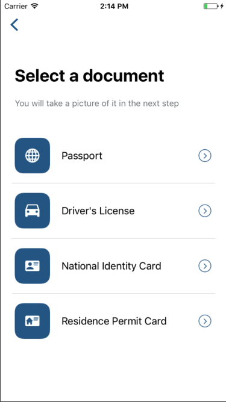
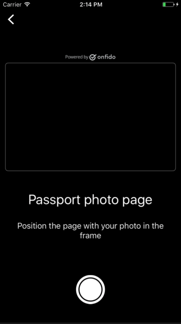
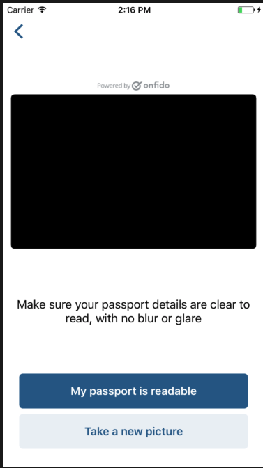

# NativeScript

Plugin for using Onfido in your NativeScript app, IOS and Android (not started yet).





Prerequisites

In order to start integration, you will need the **API token** and the **mobile SDK token**. You can use our [sandbox](https://documentation.onfido.com/#testing) environment to test your integration, and you will find these two sandbox tokens inside your [Onfido Dashboard](https://onfido.com/dashboard/api/tokens).

**Warning:** You **MUST** use the **mobile SDK token** and not the **API token** when configuring the SDK itself.
## Installation

Describe your plugin installation steps. Ideally it would be something like:

```javascript
tns plugin add nativescript-onfido
```

## Usage 

### Angular

**app.component.html**

```html
<Onfido [settings]="settings"></Onfido>
```

**app.component.ts**

```javascript
import { registerElement } from 'nativescript-angular/element-registry';
registerElement('Onfido', () => require('nativescript-onfido').Onfido);

class AppComponent {
  onfidoSettings: any;

  constructor() {
    this.onfidoSettings = {
      applicantId: "YOUR_APPLICANT_ID",
      token: "YOUR_SDK_TOKEN",
      enable: true,
      responseHandler: (response: any) => {
        if (response.userCanceled) {  
          // Flow cancelled by the user
        } else if (response.results) {
          // User completed the flow
          // You can create your check here
        } else if (response.error) {
          // Some error happened
        }
      } 
    };
  }
}
```

### JavaScript

**main-page.xml**

```html
<Page xmlns="http://schemas.nativescript.org/tns.xsd" loaded="pageLoaded" class="page"
  xmlns:ui="nativescript-onfido">
  <ui:Onfido settings="{{onfidoSettings}}"></ui:Onfido>
</Page>
```

**main-view-model.ts**

```javascript
import { Observable } from 'tns-core-modules/data/observable';

export class HelloWorldModel extends Observable {
  public onfidoSettings: any;

  constructor() {
    super();

    this.onfidoSettings = {
      applicantId: "YOUR_APPLICANT_ID",
      token: "YOUR_SDK_TOKEN",
      enable: true,
      responseHandler: (response: any) => {
        if (response.userCanceled) {  
          // Flow cancelled by the user
        } else if (response.results) {
          // User completed the flow
          // You can create your check here
        } else if (response.error) {
          // Some error happened
        }
      } 
    };
  }
}
```

## License

Apache License Version 2.0, January 2004
